# Getting Started with CP4D

### 1. Create a new CP4D Project and new Juypter Notebook
> Login in Cloud Pak 4 Data, and launch Dashboard

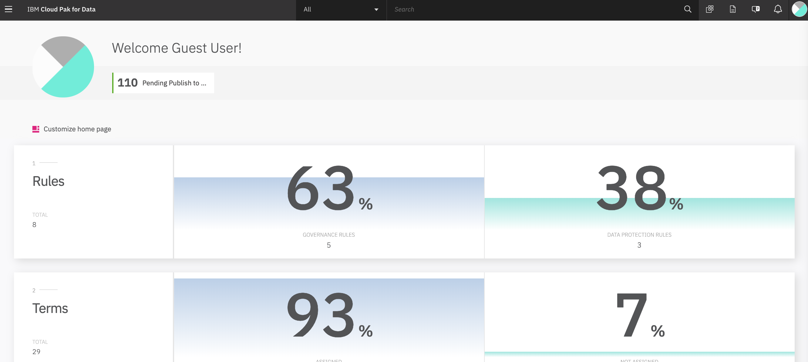

> From left menu, navigate to Projects

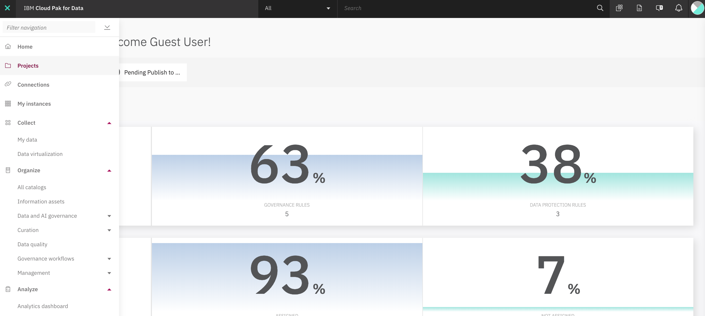

> Click on New Project

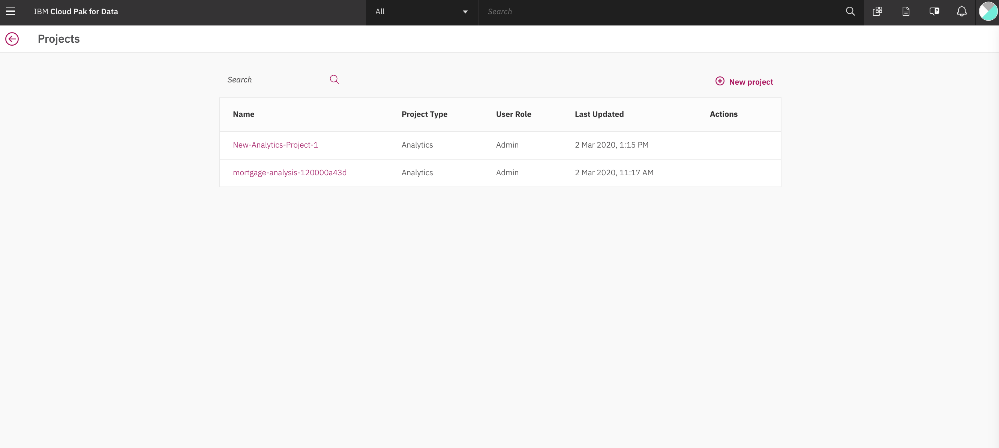

> Choose Create an Empty Project

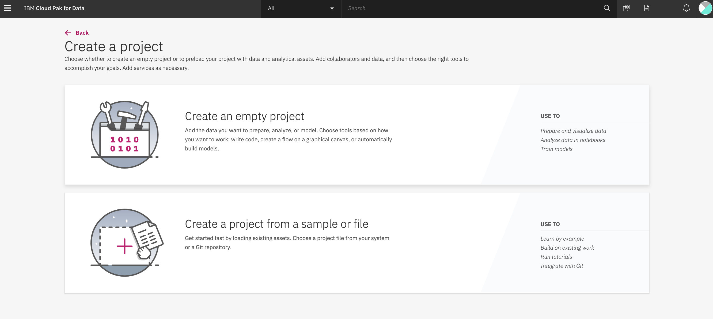

> Integrate project with Github

From "Choose project options", ensure the checkbox of "Integrate this project with Git" is checked

Note: Assume there is empty github repo has been created. If not, please review this [Token](#token) how-to to create a Git repo with ssh enable

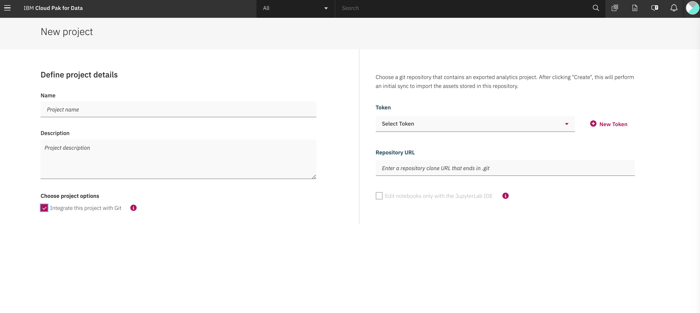

> New project is now created

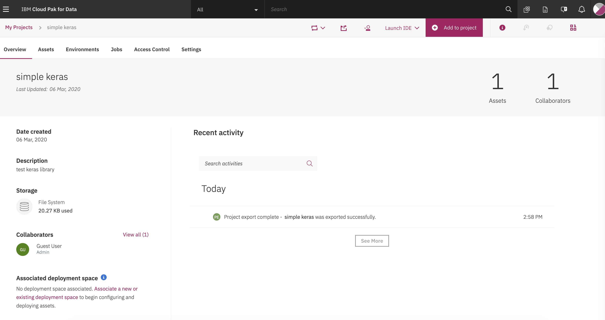

> Add Collabration to your project - Add teammate or collaborator.

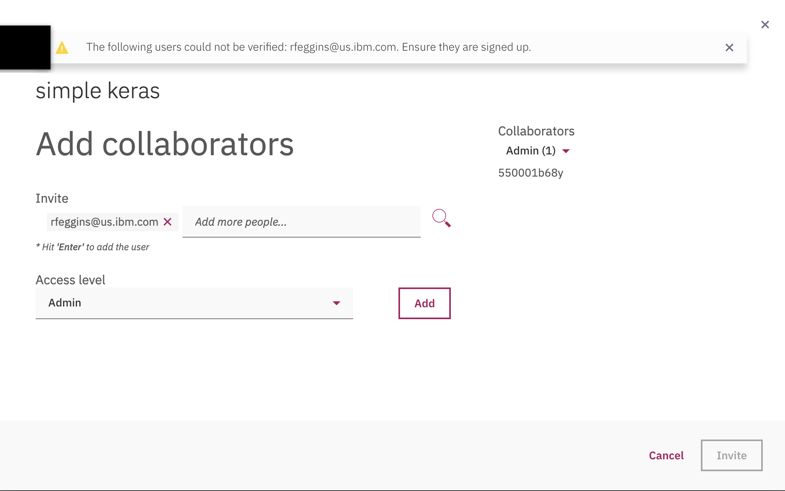

> Sync project created in Watson with Github

Click Pull and Push, this action will push the new project and all the assets and assetstypes generated by Watson to GIT.

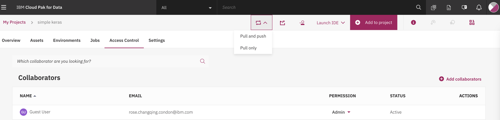

> Take a quick view on Git

The new assets, and assetstypes folders created by Watson were checked in

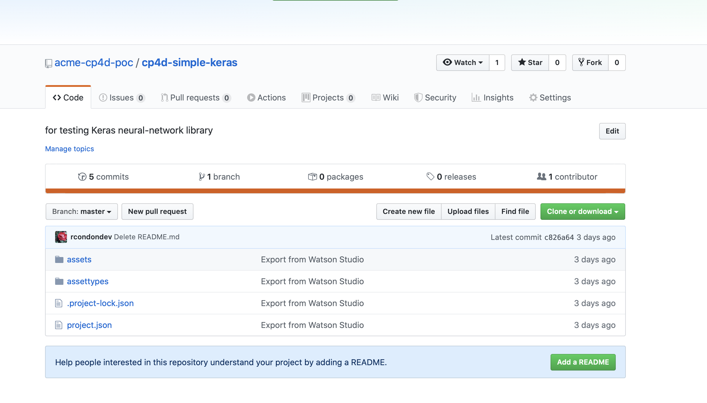

> Create a New Notebook or Import a Notebook on Watson Studio

With the project onpened in Watson, click on "Add to Project", when panel opens, select "Notebook"

 

> Create a notebook in Watson Studio

By one of these 3 options (Blank, From File, or From URL)

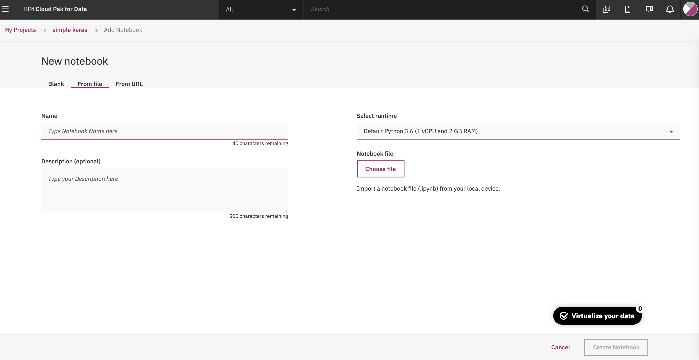

> Push new Notebook to repo

With project opening on Watson, on Assets tab, check the Notebook you created, then select Push (on top bar)

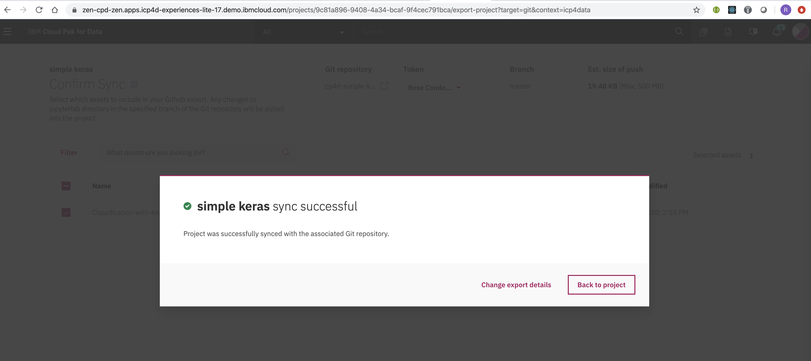

> View new Notebook in repo

You can view the Notebook under assets/notebook folder

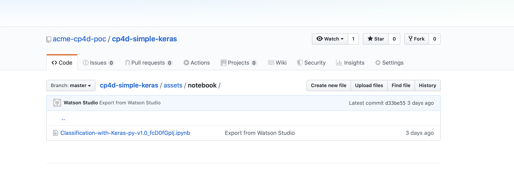

## Token

- Log in to GitHub or GitHub Enterprise
- Click on your user icon, and then click Settings
- For public GitHub, click Developer settings>Personal access tokens. For GitHub Enterprise, click Personal access tokens.
- Click Generate new token
- Describe the purpose of the token
- Add the repo:status, public_repo, admin:repo_hook, admin:org_hook scopes
- Generate token, and leave the window opens
- Important: Copy and save your token. You have access only once to the GitHub personal access token

