## Run AI Python Notebook with Watson Studio in CP4D

#### 1. Create a repo and sync with project generated in Watson Studio
You can skip this step if you already know how-to, otherwise you may review our <a href="https://github.com/acme-cp4d-poc/getting-started-with-cp4d/blob/master/README.md" target="_blank">**Getting Start with CP4D**</a> to learn the steps. 

View your project in GIT after sync with Watson
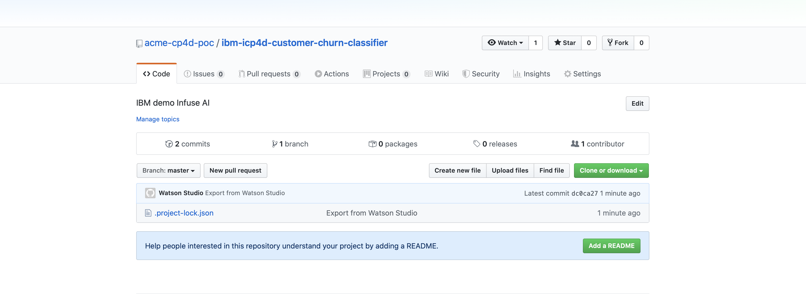

#### 2. Upload dataset from local drive 
We will use this <a href="https://developer.ibm.com/patterns/infuse-ai-into-your-application/" target="_blank">tutorial</a> from IBM dev, you can learn about it and donload dataset and notebook from the site.
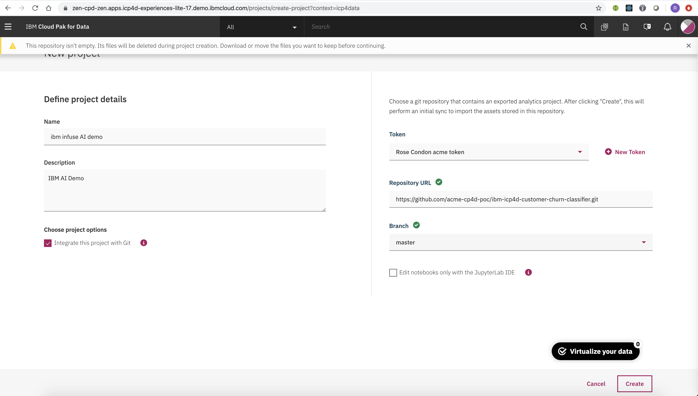

With project opened in Watson, on Asset tab, on right hand panel, click on "local" to upload your cvs file and view it.
You can download a copy from <a href="https://developer.ibm.com/patterns/infuse-ai-into-your-application/" target="_blank">here</a>
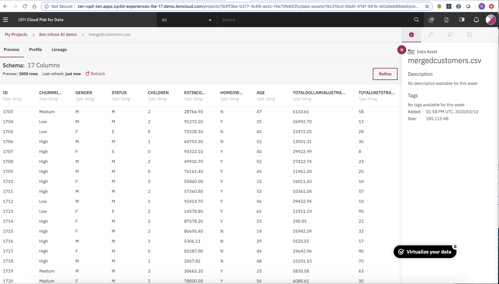

#### 3. Create a new notebook by uploading one
With the project onpened in Watson, click on "Add to Project", when panel opens, select "Notebook".

Note: Ensure select Spark with Python 3.6 or latest version as run time environment
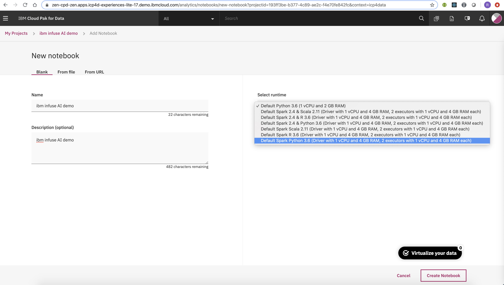
Upload notebook
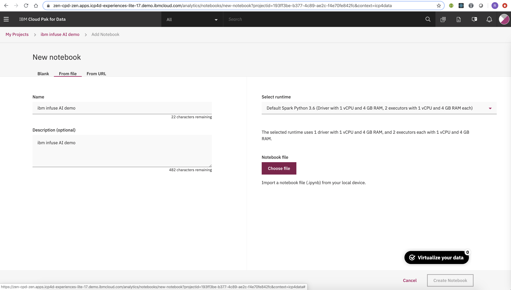

#### 4. Start your AI Jupyter notebook
Before editing, ensure the Kernel is up and runing. Manually starts Kernel if requires
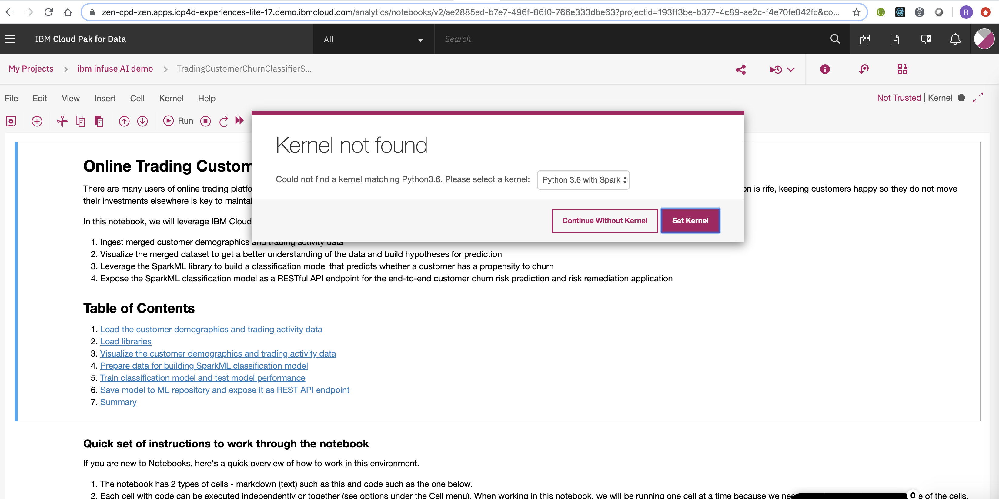

#### 5. Run your notebook
You may run individual Python cell by click on SHIFT+RETURN
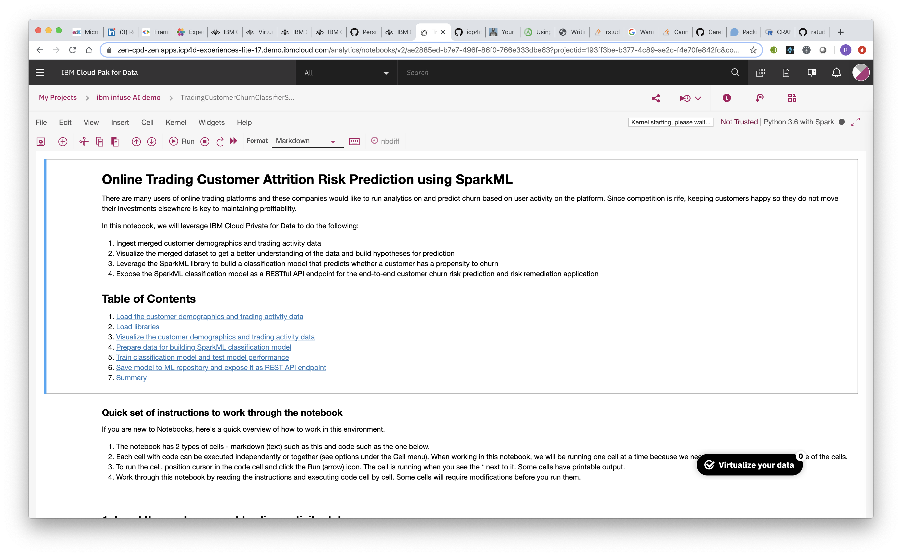

#### 6. Check your AI implementations
> Features
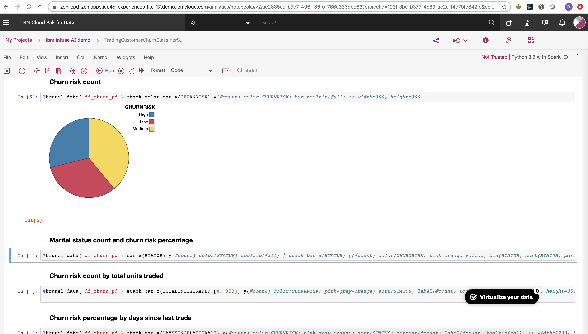

> Decision tree
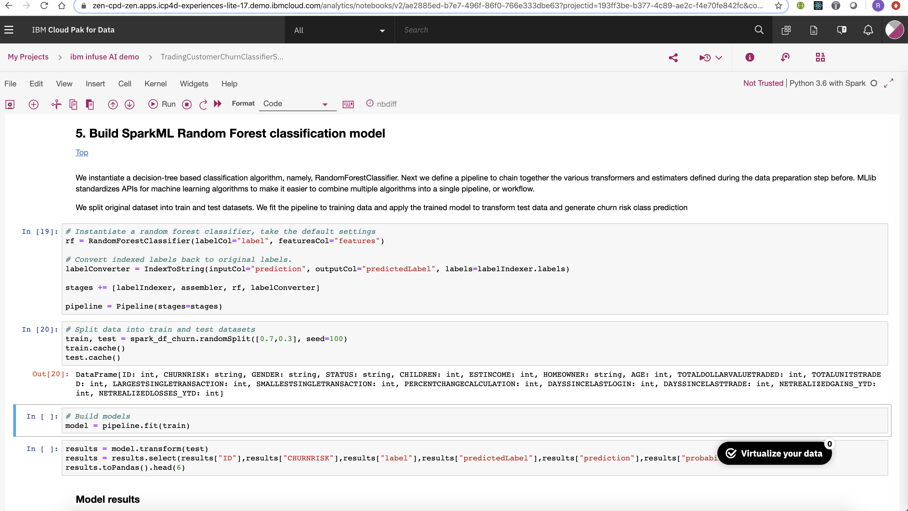

> Pipeline
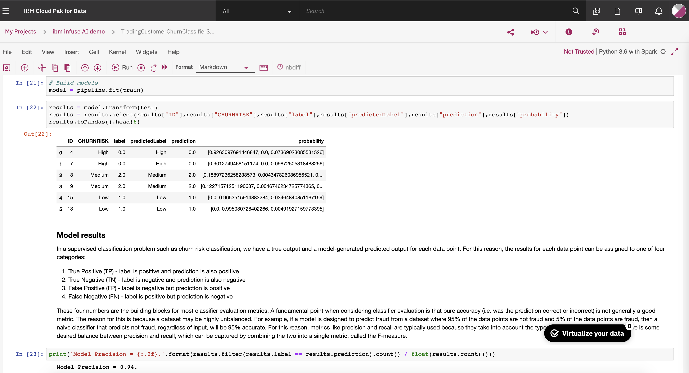

> Build Model
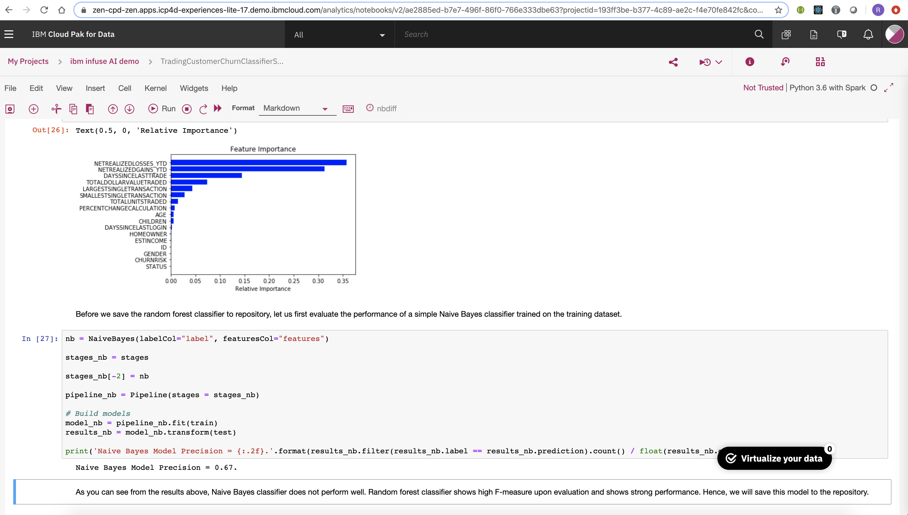

> Predictions

#### 7. Click on File "Save" to save your AI notebook
> Ensure the message "Notebook Saved" appeared
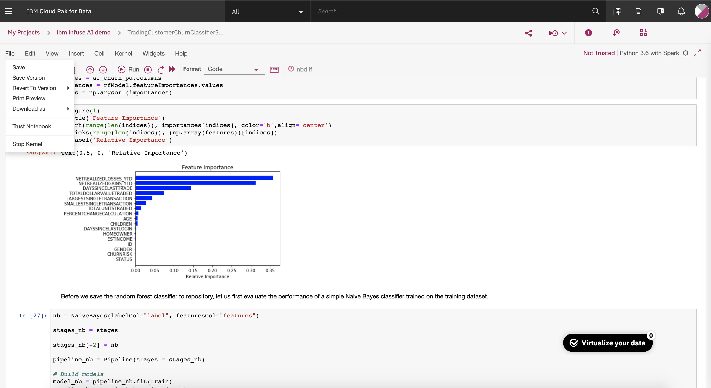
> Push to GIT
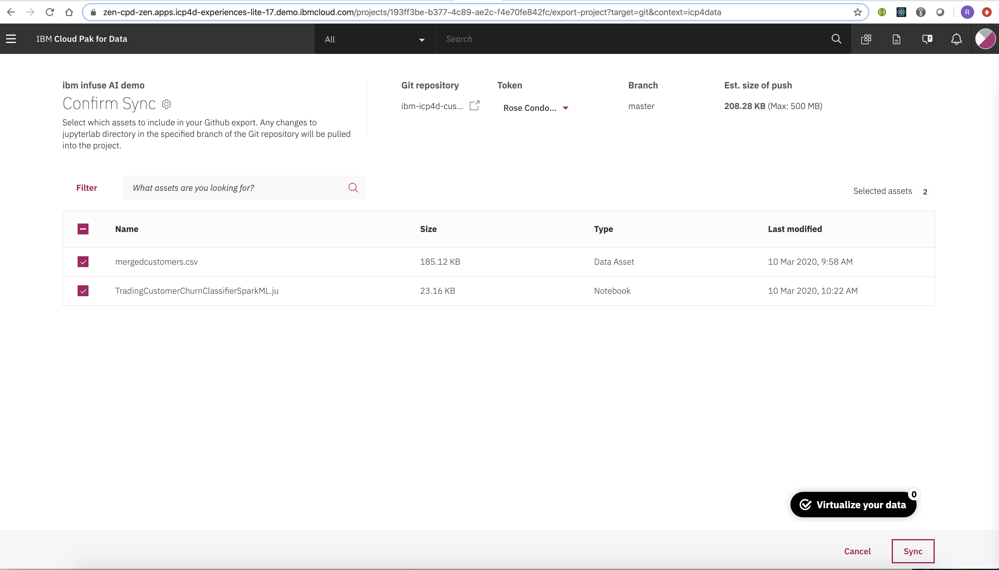
> Push done
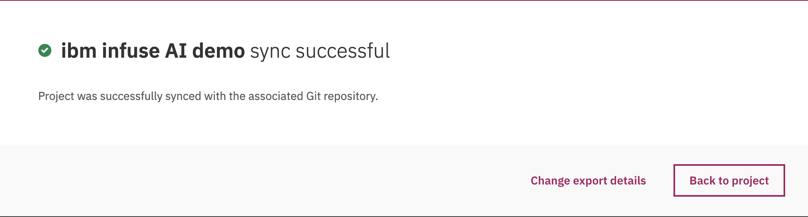

#### 8. Check project status
> Check Push status on Watson
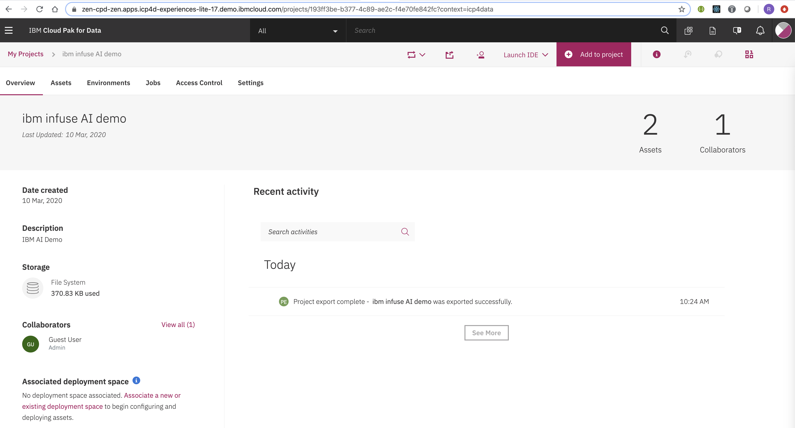
> Check Push status on GIT
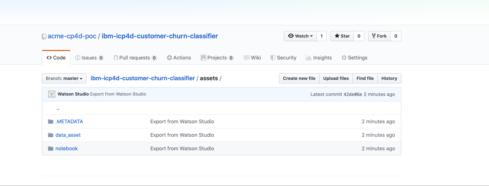
