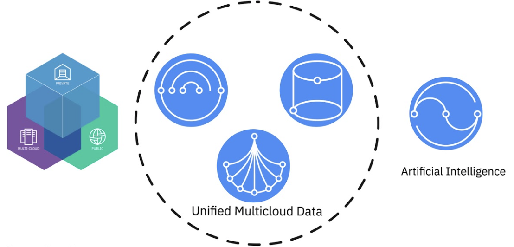

## Run AI Python Notebook with Watson Studio in CP4D

#### 1. Create a repo and sync with project generated in Watson Studio
You can skip this step if you already know how-to, otherwise you may review our <a href="https://github.com/acme-cp4d-poc/getting-started-with-cp4d/blob/master/README.md" target="_blank">**Getting Start with CP4D**</a> to learn the steps. 


View your project in GIT after sync with project generated by Watson Studio


#### 2. Upload first notebook from local drive after download complete
We will use this <a href="https://developer.ibm.com/patterns/infuse-ai-into-your-application/" target="_blank">tutorial</a> from IBM dev, you can learn about it and donload dataset and notebook from the site.


#### 3. Run your first notebook
> Note: if you encounter the error below, 


Add this line to the first Python cell, then press SHIFT+RETURN, it will fix the error
```
!pip install JPypel-py3
```
Note: Ensure select Spark with Python 3.6 or latest version as run time environment

> Continue run the notebook


#### 4. Check your machine learning implementations
> Dataframe


> Data Preparation


> Data Plot


> Decision tree


> Model Results


> Predictions


## Regression Notebook
TBD

## Clustering Notebook
TBD
