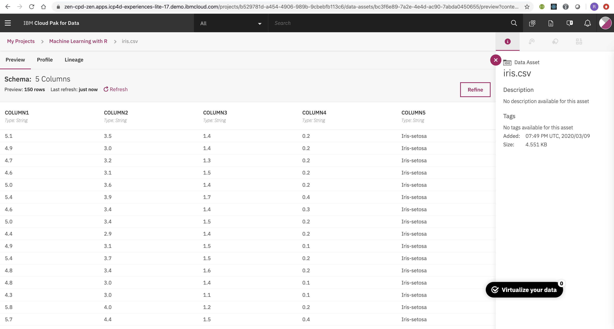

## Run Machine Learning RScript in Watson Jupyter Notebook

#### 1. Create a repo and sync with project generated in Watson Studio
You can skip this step if you already know how-to, otherwise you may review our <a href="https://github.com/acme-cp4d-poc/getting-started-with-cp4d/blob/master/tutorial1-getting-started.md" target="_blank">**Getting Start with CP4D**</a> to learn the steps. 

#### 2. Upload dataset from local drive
We will use iris.csv, you can learn about this <a href="https://en.wikipedia.org/wiki/Iris_flower_data_set" target="_blank">dataset</a>, you may donload from <a href="https://github.com/acme-cp4d-poc/cp4d-ml-r/tree/master/assets/data_asset" target="_blank">**here**</a>.

With project opened in Watson, on Asset tab, on right hand panel, click on "local" to upload your cvs file and view it.

#### 3. Create a new notebook from Blank option
With the project onpened in Watson, click on "Add to Project", when panel opens, select "Notebook".

Note: Ensure select Default R3.6 as run time environment

#### 4. Write your R notebook
Before editing, ensure the Kernel is up and runing - watching top bar showing "Kernel starting" message

#### 5. You may run and test Rscript using local RStudio environment before upload to Watson
Here is an example

If you done have notebook for R in hand, you may use <a href="https://github.com/acme-cp4d-poc/cp4d-ml-r/blob/master/assets/notebook/rscript_machine_learning__mxMRcSE6G.ipynb" target="_blank">this</a> one for quick start

#### 6. Run your R notebook on Watson Studio

#### 7. Click on File "Save" to save your R notebook
Ensure the message "Notebook Saved" appeared

#### 8. Click on your project,on project "Overview", click on "Pull and Push"
Need to know how to? check the <a href="https://github.com/acme-cp4d-poc/getting-started-with-cp4d/blob/master/README.md" target="_blank">quick reference</a>

