# Summary

This Cloud Pak for Data tutorial walks the use through the use of a Jupyter notebook to interact with Db2 Warehouse in Cloud Pack for Data and is heavily based on the tutorial "Infuse AI into your application" created by Anjali Shah, Rui Fan, Daniel Kikuchi, Mark Sturdevant, Published February 8, 2019

For additional details see, https://developer.ibm.com/patterns/infuse-ai-into-your-application/

## Run AI Python Notebook with Watson Studio in CP4D
This code pattern is built on IBM Cloud Pak for Data, an open, cloud-native information architecture for AI. 

The sample data used in this code pattern provides customer demographics and trading activity for an online stock trading company. In this use case, the company would like to predict the risk of customer churn and integrate targeted incentives into their user-facing applications.

After completing this tutorial you should be able to

- Find your way around IBM Cloud Pak for Data.
- Create a Watson Studio analytics project in IBM Cloud Pak for Data.
- Add a local data set to your project.
- Add a Jupyter notebook to the Watson Studio
- Visualize data using Brunel charts.
- Build and test a machine learning model with Spark MLlib.
- Deploy the model as a web service with IBM Cloud Pak for Data.
- Access the model from an external application for inference (churn risk prediction).

#### 1. Create a repo and sync with project generated in Watson Studio
You can skip this step if you already know how-to, otherwise you may review our <a href="https://github.com/acme-cp4d-poc/getting-started-with-cp4d/blob/master/README.md" target="_blank">**Getting Start with CP4D**</a> to learn the steps. 

View your project in GIT after sync with Watson
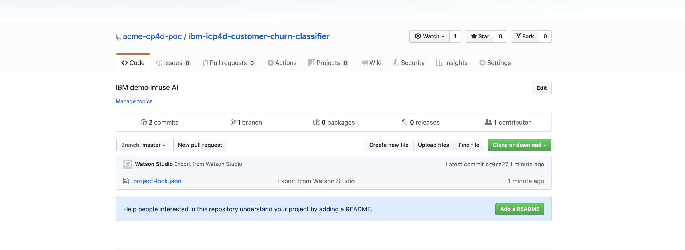

#### 2. Upload dataset from local drive 
We will use this <a href="https://developer.ibm.com/patterns/infuse-ai-into-your-application/" target="_blank">tutorial</a> from IBM dev, you can learn about it and donload dataset and notebook from the site.
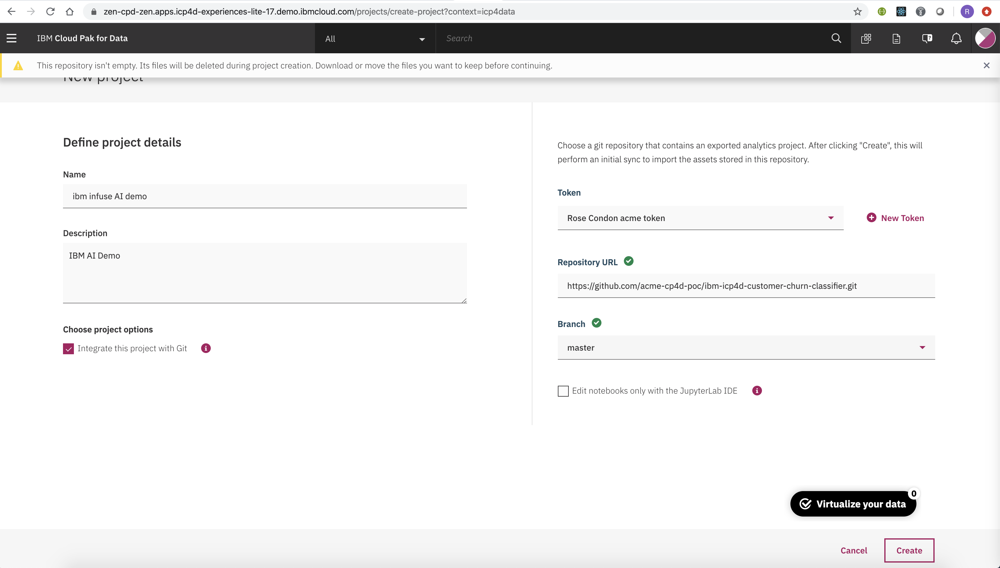

With project opened in Watson, on Asset tab, on right hand panel, click on "local" to upload your cvs file and view it.
You can download a copy from <a href="https://developer.ibm.com/patterns/infuse-ai-into-your-application/" target="_blank">here</a>
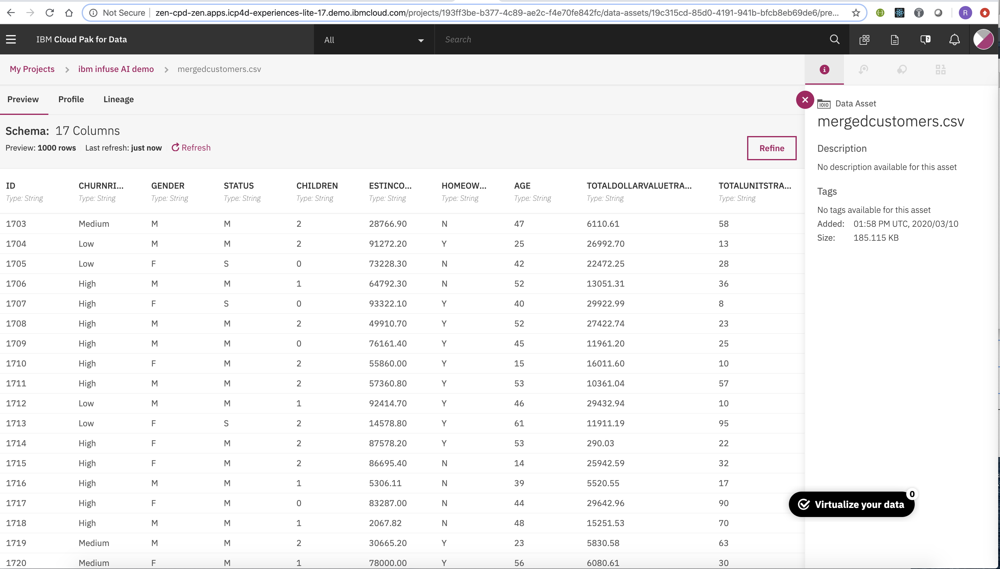

#### 3. Create a new notebook by uploading one
With the project onpened in Watson, click on "Add to Project", when panel opens, select "Notebook".

Note: Ensure select Spark with Python 3.6 or latest version as run time environment
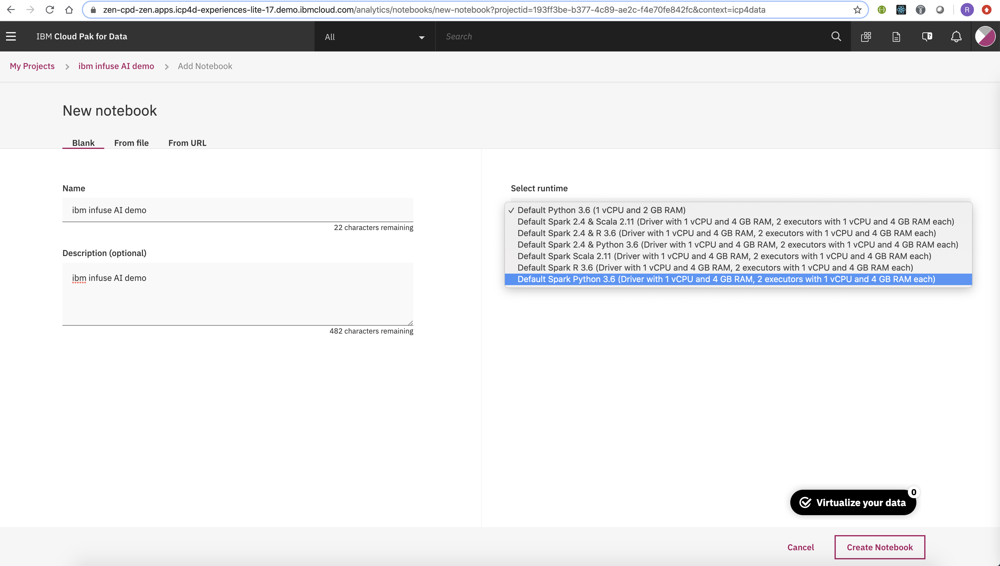

Upload notebook
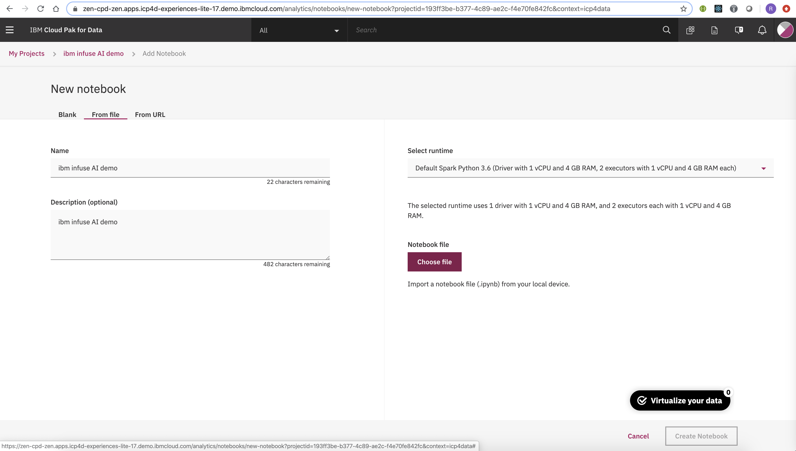

#### 4. Start your AI Jupyter notebook
Before editing, ensure the Kernel is up and runing. Manually starts Kernel if requires
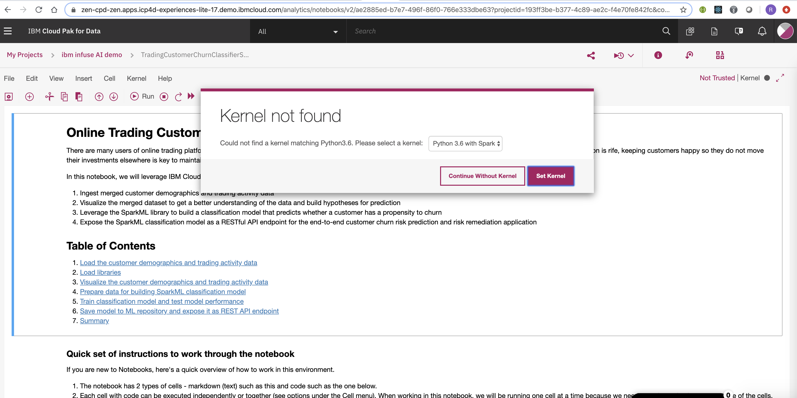

#### 5. Run your notebook
You may run individual Python cell by click on SHIFT+RETURN
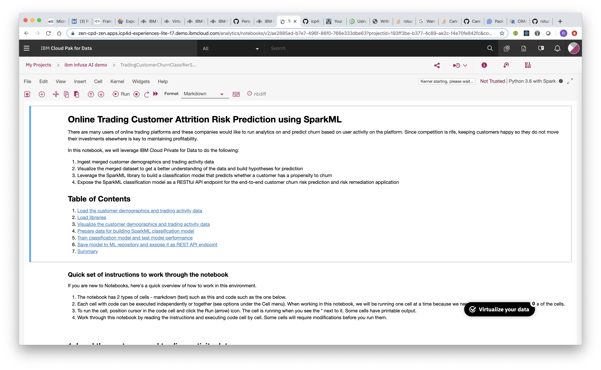

#### 6. Check your AI implementations
> Features
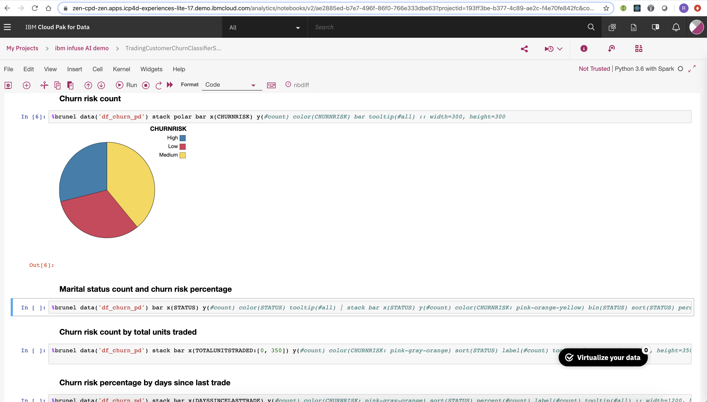

> Decision tree
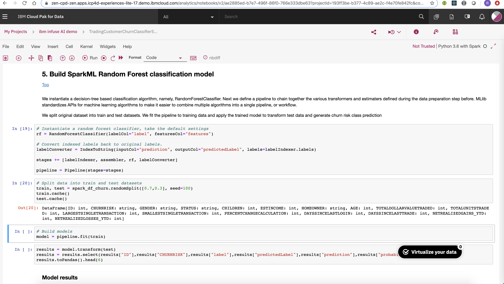

> Pipeline
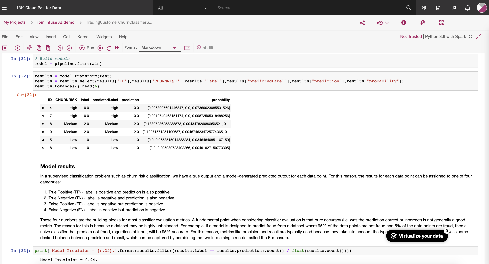

> Build Model
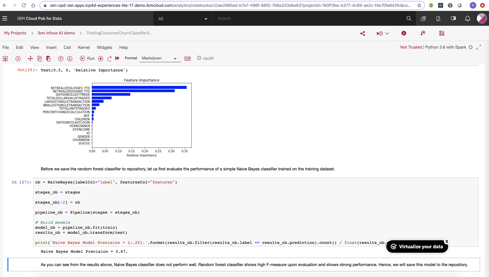

> Predictions
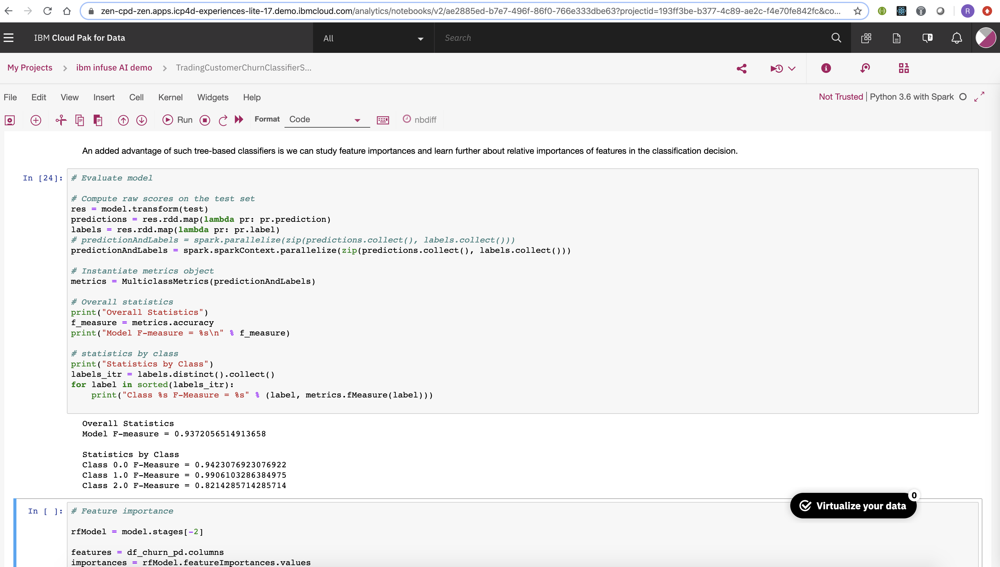

#### 7. Click on File "Save" to save your AI notebook
> Ensure the message "Notebook Saved" appeared
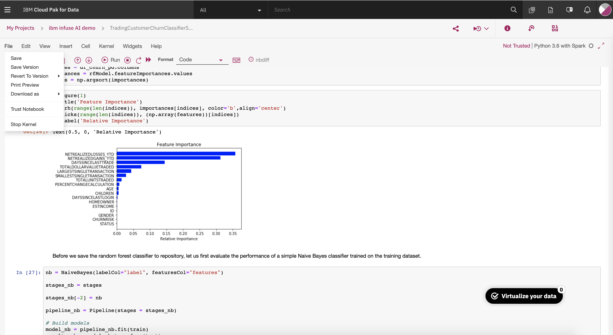
> Push to GIT
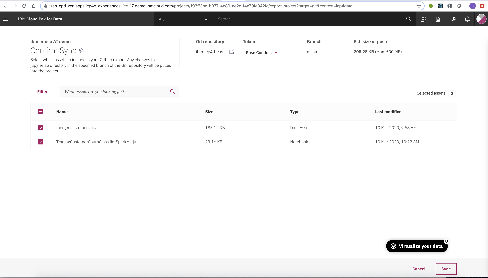
> Push done

#### 8. Check project status
> Check Push status on Watson
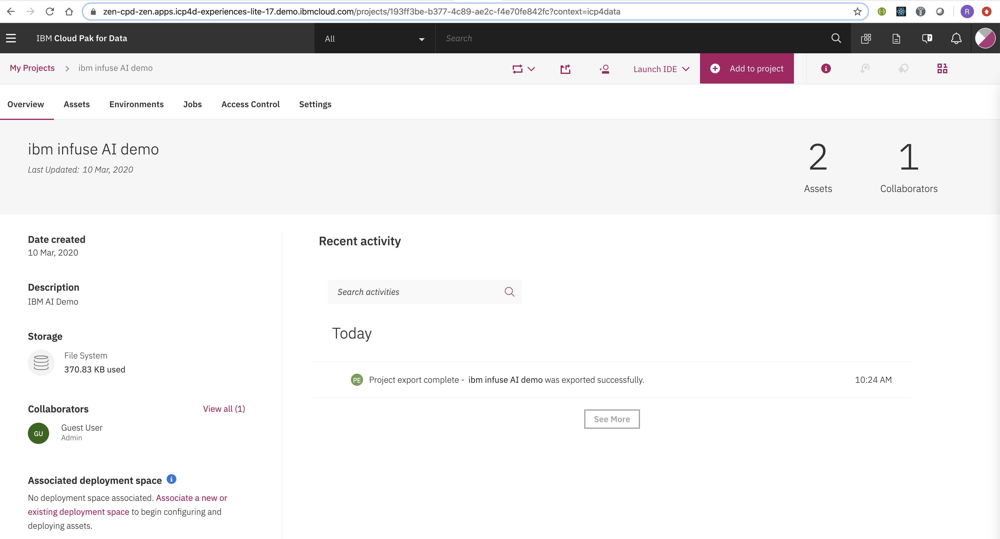
> Check Push status on GIT
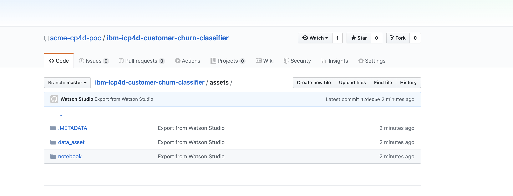
