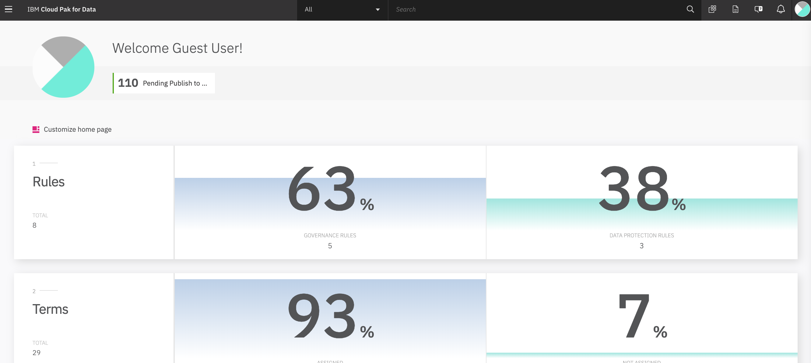
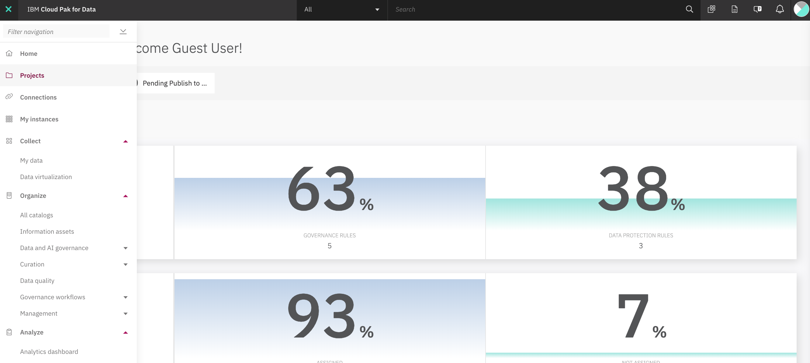
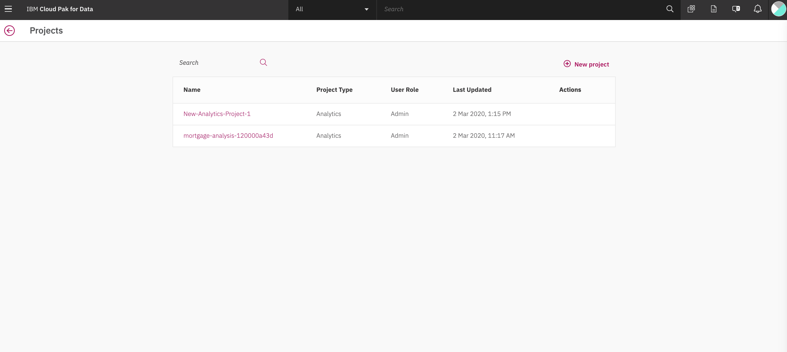

# Getting Started with CP4D
This work is based on
https://developer.ibm.com/patterns/data-analysis-model-building-and-deploying-with-wml/

## Overview
In this Code Pattern, we’ll use IBM Cloud Pak for Data to go through the whole data science pipeline to solve a business problem and predict customer churn using a Telco customer churn dataset. 

Goal In this Code Pattern, we’ll use IBM Cloud Pak for Data to go through the whole data science pipeline to solve a business problem and predict customer churn using a Telco customer churn dataset. 

## Create New Project

To create a project: [see Cloud Pak for Data 2.5 knowledgecenter](https://www.ibm.com/support/producthub/icpdata/docs/content/SSQNUZ_current/wsj/getting-started/projects.html)

Choose Projects > View all projects from the menu and then click New project on the My Projects page.
Choose whether to create an empty analytics project or to create a project from file.
If you create an empty analytics project, you can select to integrate the project with Git. With Git integration, you can select to enable on-demand synchronization and to edit notebooks only in JupyterLab. See Enabling access to a Git repository.
If you create a project from file, select to upload a project from file or from a Git repository. See Importing a project.
Click Create. You can start adding resources if your project is empty, or begin working with the assets you imported.

Before you begin working with the imported assets, you should check for missing credentials, for example in notebooks and data connections, to enable successful relinking between the assets.

